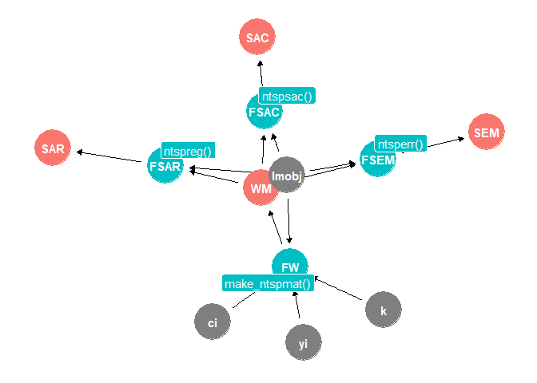

<!-- README.md is generated from README.Rmd. Please edit that file -->

# The `tscsdep` package

<!-- badges: start -->

[](https://CRAN.R-project.org/package=tscsdep)
[](https://www.repostatus.org/#active)
<!-- badges: end -->

## Description

A package to estimate models addressing spatial and temporal dependence in country-year time-series-cross sectional (TSCS) data as argued by Cook, Hays and Franzese (2021). This package provides the tools for creating geographic spatial weights matrices for unbalanced panels using k-nearest neighbors. It also provides a convenient wrapper for estimating Spatial AutoRegressive models (SAR), Spatial Error Models (SEM), and Spatial AutoCorrelation models (SAC).


The `tscsdep` package aims to provide researchers tools for analyzing country-year TSCS data with spatial and temporal dependence. It helps to diagnose spatial and temporal dependence and specify spatio-temporal models.


## Installation

It can be installed using `devtools`

    # The development version from GitHub:

    library(devtools); devtools::install_github("judechays/STADL", dependencies = TRUE)

## Functions

At present, it can create a weight matrix for all countries up until the year 2019. Maps come from the `cshapes` package.

|            Object             |          Method          |            Variables            |               Function                |
|:-----------------------------:|:------------------------:|:-------------------------------:|:-------------------------------------:|
|         Weight Matrix         |    k-nearest neighbor    | `ols` `country_name` `year` `k` | `make_ntspmat_ch(lmobj, ci, yi, k=4)` |
| Spatial AutoRegressive (SAR)  |  `spatialreg::lagsarlm`  |            `ols` `W`            |           `ntspreg(ols, W)`           |
|   Spatial error model (SEM)   | `spatialreg::errorsarlm` |            `ols` `W`            |           `ntsperr(ols, W)`           |
| Spatial Autocorrelation (SAC) |  `spatialreg::sacsarlm`  |            `ols` `W`            |           `ntspsac(ols, W)`           |

### **Weight Matrix**

The syntax for calculating the weight matrix is:

```{r, eval=F}
W<-make_ntspmat(lmobj = ols, ci = country_name, yi = year, k=4)
```

where *ols* refers to the object associated with the outcome of a regression (`lm(formula = y ~ x, data = data)`). *country_name* is the name of the variable that contains the sample countries. *year* is the name of the variable that contains the sample years. Finally, `k` refers to the number of nearest neighbors used to create the spatial weight matrix.


### **Spatial AutoRegressive (SAR)**

The package also provides a convenient wrapper to estimate the SAR model using the weight matrix.

```{r, eval=F}
ntspreg(ols, W) 
```

where *ols* again refers to the object associated with the outcome of a regression (`lm(formula = y ~ x, data = data)`), and `W` is the weight matrix created using the `make_ntspmat` function.


### **Spatial error model (SEM)**

```{r, eval=F}
ntsperr(ols, W) 
```

where *ols* again refers to the object associated with the outcome of a regression (`lm(formula = y ~ x, data = data)`), and `W` is the weight matrix created using the `make_ntspmat` function.


### **Spatial Autocorrelation (SAC)**

```{r, eval=F}
ntspsac(ols, W) 
```

where *ols* again refers to the object associated with the outcome of a regression (`lm(formula = y ~ x, data = data)`), and `W` is the weight matrix created using the `make_ntspmat` function.


### Parameters, Functions and Outputs

-   Inputs parameters (grey)
    
    The functions have four parameters as inputs: country names `ci`,
    years `yi`, number of neighbors `k`, and linear regression model
    `lmobj`.

-   Functions (blue)
    
    The functions are four. They take as inputs the parameters, and have
    some outputs.

-   Outputs (orange)
    
    Each function has an output. For example, `make_ntspmat()` function
    generates as as output the *weight matrix*.



### Tools for merging your data with `cshapes`

One of the challenges when creating the weight matrix is to match the country names from your data to the ones in `cshapes`. Therefore we describe below some functions to make the recoding process easier. Later we show how to do the recoding with an example. 


| Object                              | Description                                                                                                       | Input          | Function                    |
|-------------------------------------|-------------------------------------------------------------------------------------------------------------------|----------------|-----------------------------|
| Country name list                   | List of all country names in `cshapes`                                                                            |                | `names_list()`              |
| Country information: `cow_code`      | Provides country information in `cshapes` if you know `cow_code`. It gives: country name, start date, and end date. | `cow_code`      | `name_code(cow_code)`        |
| Country information: `country_name` | Provides country information in `cshapes` if you know `country_name`. It gives: gwcode, start date, and end date. | `country_name` | `name_text("Country name")` |

If you run the code for creating the weight matrix and you receive a message saying that *Some of your Country-Years are not Matched* you can explore `cshapes` to fix the problems as follows. 


#### List of all country names in `cshapes`

``` r
names_list()
```

You will see a list with all country names which looks like this:

    #>   [1] "United States of America"             
    #>   [2] "Canada"                               
    #>   [3] "Bahamas"                              
    #>   [4] "Cuba"                                 
    #>   [5] "Haiti"                                
    #>   [6] "Dominican Republic"                   
    #>   [7] "Jamaica"                 

#### Looking at specific countries and starting/ending dates in `cshapes` if you have countries' Correlates of War codes

Imagine, you have the US in your data with the `cow_code==2` then you can check which is the `country_name` in `cshapes`. 

``` r
name_code(2)
#> [[1]]
#> [1] "United States of America"
#> 
#> [[2]]
#> [1] "Start date"
#> 
#> [[3]]
#> [1] "1886-01-01" "1959-01-03" "1959-08-21"
#> 
#> [[4]]
#> [1] "End date"
#> 
#> [[5]]
#> [1] "1959-01-02" "1959-08-20" "2019-12-31"
```

#### Looking at specific countries and starting/ending date in `cshapes` if you have countries’ names

Imagine you have the country names, but you are not sure that the sample years you are analyzing are in `cshapes`. You can check using  

``` r
name_text("Uruguay")
#> [[1]]
#> [1] "Gleditsch and Ward code"
#> 
#> [[2]]
#> [1] 165
#> 
#> [[3]]
#> [1] "Start date"
#> 
#> [[4]]
#> [1] "1886-01-01"
#> 
#> [[5]]
#> [1] "End date"
#> 
#> [[6]]
#> [1] "2019-12-31"
```

## Example 1

The data used to estimate the following examples come from Miguel, Edward, and Shanker Satyanath. 2011. "Re-examining Economic Shocks and Civil Conflict." American Economic Journal: Applied Economics, 3 (4): 228-32. DOI: 10.1257/app.3.4.228 The Miguel and Satyanath (2011) dataset contains data on rainfall, economic growth, and civil conflict for the period 1981–1999.


### Re-examining Economic Shocks and Civil Conflict (Edward Miguel; Shanker Satyanath, 2011)

#### Load data

To begin, we read the data, and then run the (non-spatial) regression that we will use to create the weight matrix.

``` r
library(tscsdep)
```

``` r
library(haven)
data <- read_dta("AEJApp_2011-0102_Stata-data-file.dta")
```

#### OLS Estimation

``` r
# Panel C: reduced form
reg<- lm(any_prio_mss ~ gpcp_g + gpcp_g_l +as.factor(year)+as.factor(ccode), data=data)
```

#### Create the Weight Matrix: make_ntspmat

Once we have estimated our OLS model, we can run the `make_ntspmat` function, which will create a k-nearest neighbor spatial weights matrix if all countries and time period match those in `cshapes`.

We start by assuming the country names in the Miguel and Satyanath (2011) dataset match the country names from `cshapes`. Unfortunately, the dataset does not match perfectly with the names, therefore we get an error message that says *"Error in make_ntspmat(reg, country_name, year, 2): Some of your Country-Years are not Matched"* In particular, in this dataset there are 7 countries with names that do not match. We can overcome this problem by re-naming these few countries. For example "Ivory Coast" should be "Cote D'Ivoire". The country names of `cshapes` are available if you run `names_list()`, and you can also check the start (entry) and end (exit) dates using `name_text("Country Name")` and `name_code(cow_code)`.


``` r
wm <- make_ntspmat(reg,country_name,year,2)
```

    ==============================================================================
           Data Country Name       Data Start Year COW Country Name COW Start Year
    ------------------------------------------------------------------------------
    1         Burkina Faso              1981                                      
    2         Ivory Coast               1981                                      
    3          Madagascar               1981                                      
    4          Swaziland                1981                                      
    5 Tanzania, United Republic of      1981                                      
    6            Zaire                  1981                                      
    7           Zimbabwe                1981                                      
    ------------------------------------------------------------------------------

The following code re-names the countries that did not match.

``` r
library (DataCombine)

data$country_name<-recode_factor(data$country_name,"Burkina Faso"="Burkina Faso (Upper Volta)")
data$country_name<-recode_factor(data$country_name,"Ivory Coast"="Cote D'Ivoire")
data$country_name<-recode_factor(data$country_name,"Madagascar"="Madagascar (Malagasy)")
data$country_name<-recode_factor(data$country_name,"Swaziland"="Swaziland (Eswatini)")
data$country_name<-recode_factor(data$country_name,"Tanzania, United Republic of"="Tanzania (Tanganyika)")
data$country_name<-recode_factor(data$country_name,"Zaire"="Congo, Democratic Republic of (Zaire)")
data$country_name<-recode_factor(data$country_name,"Zimbabwe"="Zimbabwe (Rhodesia)")
```

Once we have corrected the country names in the dataset, we can re-run the regression and weight matrix function. While the function is working we will see the year in which the function is working, and the country-code numbers. If the weights matrix function stops before the getting to the end year, you will be able to recognize which cross-section (indexed by year) contains an error (or errors). When all of the countries are matched you will see after the year a message saying *All of your Countries are Matched.*


``` r
reg<- lm(any_prio_mss ~ gpcp_g + gpcp_g_l +as.factor(year)+as.factor(ccode), data=data)

wm <- make_ntspmat(reg,country_name,year,2)
#> [1] 1981
#>  [1] 404 420 432 433 434 435 436 437 438 439 450 451 452 461 471 475 481 482 483
#> [20] 484 490 500 501 510 516 517 520 522 530 540 541 551 552 553 560 570 571 572
#> [39] 580 625
#> [1] 1982
#>  [1] 404 420 432 433 434 435 436 437 438 439 450 451 452 461 471 475 481 482 483
#> [20] 484 490 500 501 510 516 517 520 522 530 540 541 551 552 553 560 570 571 572
#> [39] 580 625
#> [1] All of your Countries are Matched.
#> [1] 1983
#>  [1] 404 420 432 433 434 435 436 437 438 439 450 451 452 461 471 475 481 482 483
#> [20] 484 490 500 501 510 516 517 520 522 530 540 541 551 552 553 560 570 571 572
#> [39] 580 625
#> [1] All of your Countries are Matched.
#> [1] 1984
#>  [1] 404 420 432 433 434 435 436 437 438 439 450 451 452 461 471 475 481 482 483
#> [20] 484 490 500 501 510 516 517 520 522 530 540 541 551 552 553 560 570 571 572
#> [39] 580 625
#> [1] All of your Countries are Matched.
#> [1] 1985
#>  [1] 404 420 432 433 434 435 436 437 438 439 450 451 452 461 471 475 481 482 483
#> [20] 484 490 500 501 510 516 517 520 522 530 540 541 551 552 553 560 570 571 572
#> [39] 580 625
#> [1] All of your Countries are Matched.
#> [1] 1986
#>  [1] 404 420 432 433 434 435 436 437 438 439 450 451 452 461 471 475 481 482 483
#> [20] 484 490 500 501 510 516 517 520 522 530 540 541 551 552 553 560 570 571 572
#> [39] 580 625
#> [1] All of your Countries are Matched.
#> [1] 1987
#>  [1] 404 420 432 433 434 435 436 437 438 439 450 451 452 461 471 475 481 482 483
#> [20] 484 490 500 501 510 516 517 520 522 530 540 541 551 552 553 560 570 571 572
#> [39] 580 625
#> [1] All of your Countries are Matched.
#> [1] 1988
#>  [1] 404 420 432 433 434 435 436 437 438 439 450 451 452 461 471 475 481 482 483
#> [20] 484 490 500 501 510 516 517 520 522 530 540 541 551 552 553 560 570 571 572
#> [39] 580 625
#> [1] All of your Countries are Matched.
#> [1] 1989
#>  [1] 404 420 432 433 434 435 436 437 438 439 450 451 452 461 471 475 481 482 483
#> [20] 484 490 500 501 510 516 517 520 522 530 540 541 551 552 553 560 570 571 572
#> [39] 580 625
#> [1] All of your Countries are Matched.
#> [1] 1990
#>  [1] 404 420 432 433 434 435 436 437 438 439 450 451 452 461 471 475 481 482 483
#> [20] 484 490 500 501 510 516 517 520 522 530 540 541 551 552 553 560 570 571 572
#> [39] 580 625
#> [1] All of your Countries are Matched.
#> [1] 1991
#>  [1] 404 420 432 433 434 435 436 437 438 439 450 451 452 461 471 475 481 482 483
#> [20] 484 490 500 501 510 516 517 520 522 530 540 541 551 552 553 560 565 570 571
#> [39] 572 580 625
#> [1] All of your Countries are Matched.
#> [1] 1992
#>  [1] 404 420 432 433 434 435 436 437 438 439 451 452 461 471 475 481 482 483 484
#> [20] 490 500 501 510 516 517 530 540 541 551 552 553 560 565 570 571 572 580 625
#> [1] All of your Countries are Matched.
#> [1] 1993
#>  [1] 404 420 432 433 434 435 436 437 438 439 451 452 461 471 475 481 482 483 484
#> [20] 490 500 501 510 516 517 530 540 541 551 552 553 560 565 570 571 572 580 625
#> [1] All of your Countries are Matched.
#> [1] 1994
#>  [1] 404 420 432 433 434 435 436 437 438 439 451 452 461 471 475 481 482 483 484
#> [20] 490 500 501 510 516 517 530 540 541 551 552 553 560 565 570 571 572 580 625
#> [1] All of your Countries are Matched.
#> [1] 1995
#>  [1] 404 420 432 433 434 435 436 437 438 439 451 452 461 471 475 481 482 483 484
#> [20] 490 500 501 510 516 517 530 540 541 551 552 553 560 565 570 571 572 580 625
#> [1] All of your Countries are Matched.
#> [1] 1996
#>  [1] 404 420 432 433 434 435 436 437 438 439 451 452 461 471 475 481 482 483 484
#> [20] 490 500 501 510 516 517 530 540 541 551 552 553 560 565 570 571 572 580 625
#> [1] All of your Countries are Matched.
#> [1] 1997
#>  [1] 404 420 432 433 434 435 436 437 438 439 451 452 461 471 475 481 482 483 484
#> [20] 490 500 501 510 516 517 530 540 541 551 552 553 560 565 570 571 572 580 625
#> [1] All of your Countries are Matched.
#> [1] 1998
#>  [1] 404 420 432 433 434 435 436 437 438 439 451 452 461 471 475 481 482 483 484
#> [20] 490 500 501 510 516 517 530 540 541 551 552 553 560 565 570 571 572 580 625
#> [1] All of your Countries are Matched.
#> [1] 1999
#>  [1] 404 420 432 433 434 435 436 437 438 439 451 452 461 471 475 481 482 483 484
#> [20] 500 501 510 516 517 530 540 541 551 552 553 560 565 570 571 572 580
#> [1] All of your Countries are Matched.
```

#### Estimate Spatial Lag Models

`wm` provides the extracted nearest-neighbor weights matrix.

##### SAR `ntspreg`

Now, we are ready to run the wrapper function `ntspreg`, which returns a list of output using the function `lagsarlm` from the `spatialreg` package. This model only accounts for spatial dependence in the data.

With the SAR model we can see that we reject the null hypothesis that ρ=0 with 99% confidence -> **spatial interdependence**.

``` r
sar_reex <- ntspreg(reg,wm) 
summary(sar_reex)
#> 
#> Call:spatialreg::lagsarlm(formula = formula, data = df, listw = listw, 
#>     method = "eigen", zero.policy = TRUE, tol.solve = 1e-10)
#> 
#> Residuals:
#>       Min        1Q    Median        3Q       Max 
#> -0.952593 -0.120141 -0.011444  0.076592  0.985749 
#> 
#> Type: lag 
#> Coefficients: (asymptotic standard errors) 
#>                        Estimate  Std. Error z value  Pr(>|z|)
#> (Intercept)          0.04632404  0.07954454  0.5824  0.560320
#> gpcp_g               0.02179459  0.06350147  0.3432  0.731437
#> gpcp_g_l            -0.08967547  0.06423686 -1.3960  0.162711
#> as.factor(year)1982 -0.00131681  0.06442605 -0.0204  0.983693
#> as.factor(year)1983  0.01842763  0.06535506  0.2820  0.777973
#> as.factor(year)1984  0.00088191  0.06451272  0.0137  0.989093
#> as.factor(year)1985  0.00131088  0.06488204  0.0202  0.983881
#> as.factor(year)1986  0.03967123  0.06484529  0.6118  0.540682
#> as.factor(year)1987  0.01317598  0.06432836  0.2048  0.837710
#> as.factor(year)1988 -0.01478835  0.06469256 -0.2286  0.819184
#> as.factor(year)1989  0.03368085  0.06542043  0.5148  0.606667
#> as.factor(year)1990  0.15798848  0.06565322  2.4064  0.016110
#> as.factor(year)1991  0.14664424  0.06430547  2.2804  0.022582
#> as.factor(year)1992  0.06025467  0.06598596  0.9131  0.361167
#> as.factor(year)1993 -0.02931590  0.06549514 -0.4476  0.654439
#> as.factor(year)1994  0.00759373  0.06637801  0.1144  0.908920
#> as.factor(year)1995 -0.05100512  0.06545705 -0.7792  0.435853
#> as.factor(year)1996  0.01818917  0.06516725  0.2791  0.780156
#> as.factor(year)1997  0.10978272  0.06537859  1.6792  0.093116
#> as.factor(year)1998  0.20524135  0.06553358  3.1318  0.001737
#> as.factor(year)1999  0.16087604  0.06618533  2.4307  0.015070
#> as.factor(ccode)420 -0.04868108  0.09300474 -0.5234  0.600678
#> as.factor(ccode)432  0.00492448  0.09300451  0.0529  0.957773
#> as.factor(ccode)433  0.22643375  0.09329547  2.4271  0.015222
#> as.factor(ccode)434 -0.11405463  0.09300465 -1.2263  0.220074
#> as.factor(ccode)435 -0.09223683  0.09301317 -0.9917  0.321367
#> as.factor(ccode)436  0.19007035  0.09319672  2.0395  0.041405
#> as.factor(ccode)437 -0.10225871  0.09306111 -1.0988  0.271840
#> as.factor(ccode)438 -0.00093461  0.09304534 -0.0100  0.991986
#> as.factor(ccode)439  0.03018807  0.09303114  0.3245  0.745564
#> as.factor(ccode)450  0.18909018  0.10925729  1.7307  0.083508
#> as.factor(ccode)451  0.28545281  0.09379706  3.0433  0.002340
#> as.factor(ccode)452 -0.01545046  0.09302139 -0.1661  0.868082
#> as.factor(ccode)461 -0.01056529  0.09301835 -0.1136  0.909568
#> as.factor(ccode)471 -0.05363960  0.09303418 -0.5766  0.564238
#> as.factor(ccode)475 -0.09267433  0.09306211 -0.9958  0.319331
#> as.factor(ccode)481 -0.09107211  0.09303354 -0.9789  0.327621
#> as.factor(ccode)482 -0.09646788  0.09302256 -1.0370  0.299718
#> as.factor(ccode)483  0.67808682  0.09574844  7.0820 1.421e-12
#> as.factor(ccode)484 -0.00065972  0.09327228 -0.0071  0.994357
#> as.factor(ccode)490  0.48040288  0.09628319  4.9895 6.054e-07
#> as.factor(ccode)500  0.67595391  0.09538475  7.0866 1.374e-12
#> as.factor(ccode)501 -0.06999630  0.09303762 -0.7523  0.451844
#> as.factor(ccode)510 -0.09376807  0.09305750 -1.0076  0.313629
#> as.factor(ccode)516  0.26904523  0.09347602  2.8782  0.003999
#> as.factor(ccode)517  0.30424834  0.09416394  3.2310  0.001233
#> as.factor(ccode)520  0.76881453  0.11166445  6.8850 5.777e-12
#> as.factor(ccode)522 -0.03046530  0.10910693 -0.2792  0.780073
#> as.factor(ccode)530  0.56226306  0.09556239  5.8837 4.011e-09
#> as.factor(ccode)540  0.75323873  0.09736178  7.7365 1.021e-14
#> as.factor(ccode)541  0.42243584  0.09428270  4.4805 7.446e-06
#> as.factor(ccode)551 -0.09804617  0.09304366 -1.0538  0.291990
#> as.factor(ccode)552  0.00599347  0.09300640  0.0644  0.948619
#> as.factor(ccode)553 -0.11092922  0.09300644 -1.1927  0.232985
#> as.factor(ccode)560  0.48921979  0.09424400  5.1910 2.092e-07
#> as.factor(ccode)565  0.07457516  0.11756546  0.6343  0.525866
#> as.factor(ccode)570 -0.05137199  0.09301108 -0.5523  0.580728
#> as.factor(ccode)571 -0.08913072  0.09307006 -0.9577  0.338227
#> as.factor(ccode)572 -0.09049446  0.09304681 -0.9726  0.330767
#> as.factor(ccode)580 -0.09178054  0.09306428 -0.9862  0.324032
#> as.factor(ccode)625  0.66591085  0.09764945  6.8194 9.142e-12
#> 
#> Rho: 0.17125, LR test value: 24.623, p-value: 6.9698e-07
#> Asymptotic standard error: 0.033002
#>     z-value: 5.1892, p-value: 2.1119e-07
#> Wald statistic: 26.928, p-value: 2.1119e-07
#> 
#> Log likelihood: -129.8779 for lag model
#> ML residual variance (sigma squared): 0.082161, (sigma: 0.28664)
#> Number of observations: 743 
#> Number of parameters estimated: 63 
#> AIC: 385.76, (AIC for lm: 408.38)
#> LM test for residual autocorrelation
#> test value: 0.37004, p-value: 0.54298
```

##### SEM `ntsperr`

We can also compare the estimated SAR model with a Spatial Error Model using the wrapper function `ntsperr`, which returns a list of output using the function `errorsarlm` from the `spatialreg` package.

With the error model we can see that we reject the null for λ=0 with 99% confidence $\rightarrow$ **clustering in the unobservables** 

``` r
sdem_reex <- ntsperr(reg,wm)
summary(sdem_reex)
#> 
#> Call:spatialreg::errorsarlm(formula = formula, data = df, listw = listw, 
#>     method = "eigen", zero.policy = TRUE, tol.solve = 1e-11)
#> 
#> Residuals:
#>       Min        1Q    Median        3Q       Max 
#> -0.917847 -0.122026 -0.016212  0.077302  1.002628 
#> 
#> Type: error 
#> Coefficients: (asymptotic standard errors) 
#>                        Estimate  Std. Error z value  Pr(>|z|)
#> (Intercept)          7.6932e-02  9.2856e-02  0.8285 0.4073844
#> gpcp_g               2.9234e-02  6.2588e-02  0.4671 0.6404402
#> gpcp_g_l            -8.6940e-02  6.2442e-02 -1.3923 0.1638246
#> as.factor(year)1982 -1.8260e-02  6.2155e-02 -0.2938 0.7689182
#> as.factor(year)1983 -8.3182e-06  6.3772e-02 -0.0001 0.9998959
#> as.factor(year)1984 -3.7724e-02  6.3370e-02 -0.5953 0.5516444
#> as.factor(year)1985 -1.8930e-02  6.4378e-02 -0.2940 0.7687224
#> as.factor(year)1986  2.4037e-02  6.4500e-02  0.3727 0.7093990
#> as.factor(year)1987  2.5569e-03  6.4142e-02  0.0399 0.9682021
#> as.factor(year)1988 -4.7078e-02  6.3492e-02 -0.7415 0.4584067
#> as.factor(year)1989  1.9938e-02  6.3973e-02  0.3117 0.7552991
#> as.factor(year)1990  1.4639e-01  6.5111e-02  2.2483 0.0245576
#> as.factor(year)1991  1.5265e-01  6.3385e-02  2.4082 0.0160295
#> as.factor(year)1992  5.9384e-02  6.5517e-02  0.9064 0.3647320
#> as.factor(year)1993 -3.6791e-02  6.4048e-02 -0.5744 0.5656797
#> as.factor(year)1994  1.0050e-03  6.5876e-02  0.0153 0.9878283
#> as.factor(year)1995 -9.1606e-02  6.5008e-02 -1.4091 0.1587928
#> as.factor(year)1996 -1.4446e-03  6.4770e-02 -0.0223 0.9822056
#> as.factor(year)1997  8.3485e-02  6.3579e-02  1.3131 0.1891508
#> as.factor(year)1998  1.8664e-01  6.4633e-02  2.8877 0.0038812
#> as.factor(year)1999  1.2355e-01  6.4297e-02  1.9216 0.0546609
#> as.factor(ccode)420 -5.0544e-02  1.1469e-01 -0.4407 0.6594255
#> as.factor(ccode)432  1.6171e-02  1.1367e-01  0.1423 0.8868793
#> as.factor(ccode)433  2.7153e-01  1.1294e-01  2.4042 0.0162072
#> as.factor(ccode)434 -1.2790e-01  1.1164e-01 -1.1456 0.2519601
#> as.factor(ccode)435 -8.4504e-02  1.1292e-01 -0.7484 0.4542289
#> as.factor(ccode)436  2.0697e-01  1.1262e-01  1.8377 0.0661044
#> as.factor(ccode)437 -1.0834e-01  1.1267e-01 -0.9615 0.3362788
#> as.factor(ccode)438  1.3485e-02  1.1144e-01  0.1210 0.9036857
#> as.factor(ccode)439  2.4494e-02  1.1333e-01  0.2161 0.8288843
#> as.factor(ccode)450  2.8319e-01  1.3154e-01  2.1529 0.0313272
#> as.factor(ccode)451  3.2664e-01  1.1377e-01  2.8709 0.0040931
#> as.factor(ccode)452 -1.3478e-02  1.1438e-01 -0.1178 0.9061950
#> as.factor(ccode)461 -1.5148e-02  1.1403e-01 -0.1328 0.8943188
#> as.factor(ccode)471 -6.2633e-02  1.1328e-01 -0.5529 0.5803186
#> as.factor(ccode)475 -1.0308e-01  1.1302e-01 -0.9120 0.3617633
#> as.factor(ccode)481 -1.0179e-01  1.1297e-01 -0.9010 0.3675890
#> as.factor(ccode)482 -1.0212e-01  1.1240e-01 -0.9085 0.3636245
#> as.factor(ccode)483  7.9497e-01  1.1333e-01  7.0148 2.303e-12
#> as.factor(ccode)484  2.7718e-02  1.1204e-01  0.2474 0.8045972
#> as.factor(ccode)490  5.9870e-01  1.1554e-01  5.1818 2.198e-07
#> as.factor(ccode)500  7.6918e-01  1.1207e-01  6.8636 6.715e-12
#> as.factor(ccode)501 -4.6500e-02  1.1171e-01 -0.4162 0.6772280
#> as.factor(ccode)510 -7.1207e-02  1.1241e-01 -0.6335 0.5264328
#> as.factor(ccode)516  3.0142e-01  1.1238e-01  2.6821 0.0073169
#> as.factor(ccode)517  3.9659e-01  1.1247e-01  3.5260 0.0004218
#> as.factor(ccode)520  8.4956e-01  1.2807e-01  6.6336 3.277e-11
#> as.factor(ccode)522  6.4364e-03  1.3051e-01  0.0493 0.9606666
#> as.factor(ccode)530  6.5805e-01  1.1174e-01  5.8893 3.878e-09
#> as.factor(ccode)540  8.9841e-01  1.1199e-01  8.0224 1.110e-15
#> as.factor(ccode)541  4.8107e-01  1.1169e-01  4.3073 1.653e-05
#> as.factor(ccode)551 -5.0301e-02  1.1201e-01 -0.4491 0.6533765
#> as.factor(ccode)552  1.0746e-02  1.1171e-01  0.0962 0.9233615
#> as.factor(ccode)553 -1.3120e-01  1.1198e-01 -1.1716 0.2413415
#> as.factor(ccode)560  5.6153e-01  1.1192e-01  5.0174 5.237e-07
#> as.factor(ccode)565  1.5454e-01  1.3576e-01  1.1384 0.2549668
#> as.factor(ccode)570 -5.5819e-02  1.1517e-01 -0.4847 0.6279109
#> as.factor(ccode)571 -1.0455e-01  1.1448e-01 -0.9132 0.3611238
#> as.factor(ccode)572 -1.0278e-01  1.1517e-01 -0.8924 0.3721681
#> as.factor(ccode)580 -9.8489e-02  1.1446e-01 -0.8605 0.3895217
#> as.factor(ccode)625  7.9179e-01  1.1646e-01  6.7990 1.053e-11
#> 
#> Lambda: 0.19803, LR test value: 20.872, p-value: 4.9112e-06
#> Asymptotic standard error: 0.036435
#>     z-value: 5.4352, p-value: 5.4721e-08
#> Wald statistic: 29.542, p-value: 5.4721e-08
#> 
#> Log likelihood: -131.7539 for error model
#> ML residual variance (sigma squared): 0.082265, (sigma: 0.28682)
#> Number of observations: 743 
#> Number of parameters estimated: 63 
#> AIC: 389.51, (AIC for lm: 408.38)
```

##### SAC `ntspsac`

We can also compare the previous models with a SAC specification using the wrapper function `ntspsac`, which returns a list of output using the function `sacsarlm` from the `spatialreg` package.

With the SAC model we can see that we reject the null hypothesis for λ=0 with 95% confidence, and the null for  ρ=0 with 99% confidence ->  **outcome interdependence and clustering in unobservables**.


``` r
sac_reex <- ntspsac(reg,wm)
summary(sac_reex)
#> 
#> Call:spatialreg::sacsarlm(formula = formula, data = df, listw = listw, 
#>     method = "eigen", zero.policy = TRUE, tol.solve = 1e-10)
#> 
#> Residuals:
#>        Min         1Q     Median         3Q        Max 
#> -0.9379109 -0.1233086 -0.0092304  0.0743006  0.9641859 
#> 
#> Type: sac 
#> Coefficients: (asymptotic standard errors) 
#>                        Estimate  Std. Error z value  Pr(>|z|)
#> (Intercept)          0.02216543  0.06971800  0.3179  0.750538
#> gpcp_g               0.01448732  0.06219806  0.2329  0.815822
#> gpcp_g_l            -0.08747208  0.06385999 -1.3697  0.170766
#> as.factor(year)1982  0.01592022  0.06485979  0.2455  0.806103
#> as.factor(year)1983  0.03662823  0.06484243  0.5649  0.572155
#> as.factor(year)1984  0.04165778  0.06380755  0.6529  0.513843
#> as.factor(year)1985  0.02184792  0.06381200  0.3424  0.732065
#> as.factor(year)1986  0.05081839  0.06346865  0.8007  0.423314
#> as.factor(year)1987  0.02399967  0.06276419  0.3824  0.702181
#> as.factor(year)1988  0.01994228  0.06420593  0.3106  0.756106
#> as.factor(year)1989  0.04434012  0.06495640  0.6826  0.494851
#> as.factor(year)1990  0.16576853  0.06423976  2.5805  0.009867
#> as.factor(year)1991  0.13199709  0.06331134  2.0849  0.037079
#> as.factor(year)1992  0.06262245  0.06446006  0.9715  0.331303
#> as.factor(year)1993 -0.01823035  0.06542423 -0.2786  0.780515
#> as.factor(year)1994  0.01445145  0.06495045  0.2225  0.823925
#> as.factor(year)1995 -0.00945440  0.06447420 -0.1466  0.883417
#> as.factor(year)1996  0.03162778  0.06365412  0.4969  0.619281
#> as.factor(year)1997  0.12808992  0.06546483  1.9566  0.050392
#> as.factor(year)1998  0.21392700  0.06435594  3.3241  0.000887
#> as.factor(year)1999  0.18981137  0.06608886  2.8721  0.004078
#> as.factor(ccode)420 -0.04742942  0.07629721 -0.6216  0.534178
#> as.factor(ccode)432 -0.00481202  0.07682128 -0.0626  0.950054
#> as.factor(ccode)433  0.18239976  0.07867674  2.3183  0.020431
#> as.factor(ccode)434 -0.09705340  0.07789043 -1.2460  0.212755
#> as.factor(ccode)435 -0.09434969  0.07722991 -1.2217  0.221831
#> as.factor(ccode)436  0.16772210  0.07846467  2.1375  0.032553
#> as.factor(ccode)437 -0.09405033  0.07745748 -1.2142  0.224664
#> as.factor(ccode)438 -0.01300904  0.07810063 -0.1666  0.867710
#> as.factor(ccode)439  0.02772568  0.07715547  0.3593  0.719335
#> as.factor(ccode)450  0.12463360  0.09148069  1.3624  0.173071
#> as.factor(ccode)451  0.24226245  0.08009160  3.0248  0.002488
#> as.factor(ccode)452 -0.01819298  0.07648363 -0.2379  0.811984
#> as.factor(ccode)461 -0.01084024  0.07664588 -0.1414  0.887528
#> as.factor(ccode)471 -0.05154948  0.07701198 -0.6694  0.503260
#> as.factor(ccode)475 -0.08492720  0.07732155 -1.0984  0.272046
#> as.factor(ccode)481 -0.08372318  0.07724867 -1.0838  0.278447
#> as.factor(ccode)482 -0.09244197  0.07758551 -1.1915  0.233463
#> as.factor(ccode)483  0.57108063  0.08937493  6.3897 1.662e-10
#> as.factor(ccode)484 -0.01349206  0.07828004 -0.1724  0.863157
#> as.factor(ccode)490  0.38624969  0.08573322  4.5053 6.629e-06
#> as.factor(ccode)500  0.57735381  0.08967370  6.4384 1.208e-10
#> as.factor(ccode)501 -0.07485710  0.07786490 -0.9614  0.336365
#> as.factor(ccode)510 -0.10139122  0.07769346 -1.3050  0.191887
#> as.factor(ccode)516  0.23589954  0.07988957  2.9528  0.003149
#> as.factor(ccode)517  0.22844524  0.08182836  2.7918  0.005242
#> as.factor(ccode)520  0.68045788  0.10529935  6.4621 1.032e-10
#> as.factor(ccode)522 -0.04501664  0.09131037 -0.4930  0.622008
#> as.factor(ccode)530  0.47837780  0.08861177  5.3986 6.717e-08
#> as.factor(ccode)540  0.62049676  0.09594730  6.4671 9.993e-11
#> as.factor(ccode)541  0.36356906  0.08395132  4.3307 1.486e-05
#> as.factor(ccode)551 -0.11854251  0.07773562 -1.5249  0.127273
#> as.factor(ccode)552  0.00025641  0.07786268  0.0033  0.997372
#> as.factor(ccode)553 -0.09346464  0.07770982 -1.2027  0.229077
#> as.factor(ccode)560  0.41622221  0.08424316  4.9407 7.783e-07
#> as.factor(ccode)565  0.02774017  0.10180873  0.2725  0.785258
#> as.factor(ccode)570 -0.04929730  0.07619585 -0.6470  0.517644
#> as.factor(ccode)571 -0.07919499  0.07673022 -1.0321  0.302015
#> as.factor(ccode)572 -0.08016292  0.07634798 -1.0500  0.293733
#> as.factor(ccode)580 -0.08538860  0.07669083 -1.1134  0.265531
#> as.factor(ccode)625  0.55761989  0.09147930  6.0956 1.090e-09
#> 
#> Rho: 0.30996
#> Asymptotic standard error: 0.061577
#>     z-value: 5.0338, p-value: 4.8088e-07
#> Lambda: -0.20054
#> Asymptotic standard error: 0.08275
#>     z-value: -2.4234, p-value: 0.015375
#> 
#> LR test value: 26.282, p-value: 1.963e-06
#> 
#> Log likelihood: -129.0487 for sac model
#> ML residual variance (sigma squared): 0.078743, (sigma: 0.28061)
#> Number of observations: 743 
#> Number of parameters estimated: 64 
#> AIC: 386.1, (AIC for lm: 408.38)
```

##### Interpretation and diagnostic

In addition to Wald and Likelihood Ratio specification tests, you can compare the BIC scores for evidence of interdependence and (or) clustering in the unobservables.


``` r
BIC(sar_reex)
#> [1] 676.2297
BIC(sdem_reex)
#> [1] 679.9816
BIC(sac_reex)
#> [1] 681.1819
```

In this example the *SAR* model is the one with the lowest BIC.

You can also extract the log-likelihood of each model.

``` r
logLik(sar_reex)
#> 'log Lik.' -129.8779 (df=63)
logLik(sdem_reex)
#> 'log Lik.' -131.7539 (df=63)
logLik(sac_reex)
#> 'log Lik.' -129.0487 (df=64)
```

#### What is next?

You can repeat the process using a different number of `k` neighbors.

``` r
reg<- lm(any_prio_mss ~ gpcp_g + gpcp_g_l +as.factor(year)+as.factor(ccode), data=data)

wm <- make_ntspmat(reg,country_name,year,10)
```

## Example 2

### Income and Democracy (Acemoglu, et al 2008)

The data used to estimate the following examples come from Acemoglu, D., Johnson, S., Robinson, J. A. & Yared, P. (2008), "Income and democracy", American Economic Review 98(3), 808–42. The Acemoglu, et al. (2008) dataset contains data on countries' GDP, and democracy (Polity IV score) for the period 1960–2000 (every 5 years).

The dependent variable, democracy (`polity4`) is Polity IV score. The main independent variable, is GDP per capita (in PPP) `lrgdpchL`. 

As previously, we start by creating the weight matrix after matching country name. Then we estimate results for the SAR, SEM, and SAC models with a lagged dependent variable `polity4L`. 


#### Load data

``` r
data<-read.csv("aer_5year_APSR_full.csv")
```

#### OLS estimation

``` r
reg<-lm(formula = polity4 ~ polity4L + lrgdpchL + as.factor(year), data = data)
```

#### Create the Weight Matrix: `make_ntspmat`

``` r
wm <- make_ntspmat(reg,country,year,10)
```

Countries that did not match.

    =======================================================================
        Data Country Name   Data Start Year COW Country Name COW Start Year
    -----------------------------------------------------------------------
    1        Belarus             2000                                      
    2      Burkina Faso          1965                                      
    3        Cambodia            2000                                      
    4    Congo, Dem. Rep.        1970                                      
    5      Congo, Rep.           1965                                      
    6     Cote d'Ivoire          1965                                      
    7    Egypt, Arab Rep.        1960                                      
    8   Ethiopia -pre 1993       1960                                      
    9     Ethiopia 1993-         2000                                      
    10     Gambia, The           1970                                      
    11       Germany             1995                                      
    12         Iran              1960                                      
    13        Italy              1960                                      
    14     Korea, Rep.           1960                                      
    15    Macedonia, FYR         2000                                      
    16      Madagascar           1965                                      
    17  Pakistan-post-1972       1980                                      
    18  Pakistan-pre-1972        1960                                      
    19       Romania             1965                                      
    20        Russia             2000                                      
    21      Sri Lanka            1960                                      
    22 Syrian Arab Republic      1970                                      
    23       Tanzania            1970                                      
    24        Turkey             1970                                      
    25    United States          1960                                      
    26    Venezuela, RB          1960                                      
    27       Vietnam             1995                                      
    28        Yemen              2000                                      
    29       Zimbabwe            1975                                      
    -----------------------------------------------------------------------

**Fixing country names**

``` r
library (DataCombine)

data$country<-recode_factor(data$country,"Korea, Rep."="Korea, Republic of")
data$country<-recode_factor(data$country,"Egypt, Arab Rep."="Egypt")
data$country<-recode_factor(data$country,"Gambia, The"="Gambia")
data$country<-recode_factor(data$country,"Ethiopia 1993-"="Ethiopia")
data$country<-recode_factor(data$country,"Ethiopia -pre 1993"="Ethiopia")
data$country<-recode_factor(data$country,"Pakistan-pre-1972"="Pakistan")
data$country<-recode_factor(data$country,"Pakistan-post-1972"="Pakistan")
data$country<-recode_factor(data$country,"Belarus"="Belarus (Byelorussia)")
data$country<-recode_factor(data$country,"Syrian Arab Republic"="Syria")
data$country<-recode_factor(data$country,"Venezuela, RB"="Venezuela")
data$country<-recode_factor(data$country,"Vietnam"="Vietnam, Democratic Republic of")
data$country<-recode_factor(data$country,"Russia"="Russia (Soviet Union)")
data$country<-recode_factor(data$country,"Yemen"="Yemen (Arab Republic of Yemen)")
data$country<-recode_factor(data$country,"United States"="United States of America")
data$country<-recode_factor(data$country,"Tanzania"="Tanzania (Tanganyika)")
data$country<-recode_factor(data$country,"Burkina Faso"="Burkina Faso (Upper Volta)")
data$country<-recode_factor(data$country,"Cambodia"="Cambodia (Kampuchea)")
data$country<-recode_factor(data$country,"Zimbabwe"="Zimbabwe (Rhodesia)")
data$country<-recode_factor(data$country,"Cote d'Ivoire"="Cote D'Ivoire")
data$country<-recode_factor(data$country,"Germany"="German Federal Republic")
data$country<-recode_factor(data$country,"Iran"="Iran (Persia)")
data$country<-recode_factor(data$country,"Italy"="Italy/Sardinia")
data$country<-recode_factor(data$country,"Turkey"="Turkey (Ottoman Empire)")
data$country<-recode_factor(data$country,"Congo, Dem. Rep."="Congo, Democratic Republic of (Zaire)")
data$country<-recode_factor(data$country,"Congo, Rep."="Congo")
data$country<-recode_factor(data$country,"Kyrgyzstan"="Kyrgyz Republic")
data$country<-recode_factor(data$country,"Madagascar"="Madagascar (Malagasy)")
data$country<-recode_factor(data$country,"Sri Lanka"="Sri Lanka (Ceylon)")
data$country<-recode_factor(data$country,"Macedonia, FYR"="Macedonia (FYROM/North Macedonia)")
data$country<-recode_factor(data$country,"Romania"="Rumania")
```

``` r
reg<-lm(formula = polity4 ~ polity4L + lrgdpchL + as.factor(year), data = data)
```

``` r
wm <- make_ntspmat(reg,country,year,10)
#> [1] 1960
#>  [1] 900 305 211 140 20  225 155 710 100 94  390 42  130 651 230 530 375 220 200
#> [20] 350 90  91  750 205 630 395 666 325 663 740 732 780 70  93  210 385 920 770
#> [39] 95  135 840 235 150 92  380 800 713 165 2   101 560
#> [1] 1965
#>  [1] 160 900 305 211 434 439 145 140 482 20  225 155 710 437 471 484 100 94  390
#> [20] 130 651 230 530 375 220 481 200 452 438 350 90  91  850 750 205 630 395 666
#> [39] 325 663 740 732 780 600 580 70  432 435 820 436 475 93  210 385 790 920 770
#> [58] 95  135 840 235 150 360 433 92  380 483 461 800 713 165 2   101 560
#> [1] All of your Countries are Matched.
#> [1] 1970
#>  [1] 160 900 305 211 434 439 145 140 482 20  225 155 710 437 471 484 100 94  390
#> [20] 615 130 651 230 530 375 220 481 200 452 438 420 350 90  91  850 750 205 630
#> [39] 395 666 325 51  663 740 501 732 780 600 580 70  432 435 553 820 436 475 93 
#> [58] 210 385 790 920 95  135 840 235 150 360 517 433 830 451 92  380 652 483 461
#> [77] 800 52  616 640 713 510 500 165 2   101 560 490 551
#> [1] All of your Countries are Matched.
#> [1] 1975
#>  [1] 160 900 305 516 211 434 439 145 140 571 482 20  225 155 710 437 471 484 100
#> [20] 94  352 390 42  615 130 651 530 375 950 220 481 200 452 438 420 411 350 90 
#> [39] 110 91  41  310 850 750 205 630 395 666 325 51  663 740 501 732 780 570 600
#> [58] 580 70  432 435 590 553 820 436 475 93  210 385 790 920 95  135 840 150 360
#> [77] 517 433 830 451 92  380 652 483 461 800 52  616 640 713 510 500 165 2   101
#> [96] 560 490 551 552
#> [1] All of your Countries are Matched.
#> [1] 1980
#>   [1] 540 160 900 305 516 211 434 439 771 145 140 571 482 20  225 155 710 437
#>  [19] 471 484 100 581 94  352 390 42  615 130 651 530 375 950 220 481 200 452
#>  [37] 438 420 404 411 350 90  110 41  310 850 750 205 395 666 325 51  663 740
#>  [55] 501 732 780 570 600 580 70  432 541 435 590 553 820 436 475 210 385 790
#>  [73] 920 770 95  135 840 910 150 360 517 433 830 451 380 652 461 800 52  616
#>  [91] 640 713 510 500 165 2   101 560 490 551 552
#> [1] All of your Countries are Matched.
#> [1] 1985
#>   [1] 540 160 900 305 516 211 434 439 771 145 140 571 482 20  225 155 710 437
#>  [19] 471 484 100 581 94  352 390 42  615 130 651 230 530 375 950 220 481 200
#>  [37] 452 438 420 404 411 350 110 41  310 850 750 205 395 666 325 51  663 740
#>  [55] 501 732 780 570 600 580 70  432 541 435 590 553 820 436 475 210 385 790
#>  [73] 920 770 95  135 840 910 290 235 150 360 517 433 830 451 380 652 461 800
#>  [91] 52  616 640 713 510 165 2   101 560 490 551 552
#> [1] All of your Countries are Matched.
#> [1] 1990
#>   [1] 540 160 900 305 516 211 439 771 145 140 571 482 20  225 155 710 437 471
#>  [19] 484 100 581 94  40  352 390 42  615 130 651 230 530 375 950 220 200 452
#>  [37] 438 420 404 411 350 110 91  41  310 850 750 205 630 395 666 325 51  663
#>  [55] 740 501 732 780 570 600 580 70  432 541 435 590 553 820 436 475 93  210
#>  [73] 385 790 920 770 95  135 840 910 290 235 150 360 517 433 830 451 92  380
#>  [91] 652 483 461 800 52  616 640 713 510 165 2   101 560 490 551 552
#> [1] All of your Countries are Matched.
#> [1] 1995
#>   [1] 160 900 305 211 439 771 145 140 571 482 20  225 155 710 437 471 484 100
#>  [19] 94  40  352 255 390 42  615 130 651 230 375 950 220 200 452 438 420 404
#>  [37] 411 350 90  110 91  41  310 850 750 205 630 395 666 325 51  663 740 501
#>  [55] 732 780 570 600 580 70  432 541 435 590 553 820 565 436 475 93  210 385
#>  [73] 790 920 770 95  135 840 910 290 235 150 360 517 433 830 451 92  380 652
#>  [91] 483 461 800 52  616 640 713 510 500 165 2   101 816 560 551 552
#> [1] All of your Countries are Matched.
#> [1] 2000
#>   [1] 339 160 371 900 305 373 211 434 439 771 355 370 145 140 571 482 20  225
#>  [19] 155 710 437 471 484 100 94  40  352 316 255 390 42  615 130 651 230 366
#>  [37] 530 375 220 481 200 452 438 420 404 411 350 90  110 91  344 41  310 850
#>  [55] 750 205 630 395 666 325 51  663 740 705 501 703 811 732 780 368 367 600
#>  [73] 359 580 70  343 432 541 435 590 553 820 565 436 475 93  210 385 790 920
#>  [91] 770 95  840 910 290 235 150 360 365 517 433 830 92  317 349 380 652 483
#> [109] 461 800 52  616 640 713 510 500 369 165 2   704 101 816 679 560 551 552
#> [1] All of your Countries are Matched.
```

#### Estimate Spatial Lag Models

##### SAR `ntspreg`

The Wald test from the SAR model rejects the null hypothesis for *ρ*=0 at 95% confidence, suggesting spatial interdependence.

``` r
lag <- ntspreg(reg,wm)
summary(lag)
#> 
#> Call:spatialreg::lagsarlm(formula = formula, data = df, listw = listw, 
#>     method = "eigen", zero.policy = TRUE, tol.solve = 1e-10)
#> 
#> Residuals:
#>        Min         1Q     Median         3Q        Max 
#> -0.7549372 -0.0809244 -0.0095003  0.0670258  0.6844804 
#> 
#> Type: lag 
#> Coefficients: (asymptotic standard errors) 
#>                       Estimate Std. Error z value  Pr(>|z|)
#> (Intercept)         -0.3079667  0.0656794 -4.6889 2.746e-06
#> polity4L             0.7457442  0.0214521 34.7633 < 2.2e-16
#> lrgdpchL             0.0531095  0.0079384  6.6902 2.229e-11
#> as.factor(year)1965 -0.0589817  0.0330236 -1.7860   0.07409
#> as.factor(year)1970 -0.0751453  0.0319103 -2.3549   0.01853
#> as.factor(year)1975 -0.0758992  0.0313635 -2.4200   0.01552
#> as.factor(year)1980 -0.0436485  0.0313208 -1.3936   0.16344
#> as.factor(year)1985 -0.0306376  0.0313216 -0.9782   0.32799
#> as.factor(year)1990  0.0407703  0.0310648  1.3124   0.18938
#> as.factor(year)1995  0.0733024  0.0309442  2.3689   0.01784
#> as.factor(year)2000  0.0157911  0.0301255  0.5242   0.60016
#> 
#> Rho: 0.092467, LR test value: 4.488, p-value: 0.034134
#> Asymptotic standard error: 0.042432
#>     z-value: 2.1792, p-value: 0.02932
#> Wald statistic: 4.7487, p-value: 0.02932
#> 
#> Log likelihood: 247.2436 for lag model
#> ML residual variance (sigma squared): 0.032792, (sigma: 0.18109)
#> Number of observations: 854 
#> Number of parameters estimated: 13 
#> AIC: -468.49, (AIC for lm: -466)
#> LM test for residual autocorrelation
#> test value: 0.33204, p-value: 0.56446
```

##### SEM `ntsperr`

The Wald test from the SEM fails to reject the null hypothesis for *λ*=0, suggesting there may not be clustering in the unobservables.

``` r
lag_err <- ntsperr(reg,wm)
summary(lag_err)
#> 
#> Call:spatialreg::errorsarlm(formula = formula, data = df, listw = listw, 
#>     method = "eigen", zero.policy = TRUE, tol.solve = 1e-11)
#> 
#> Residuals:
#>       Min        1Q    Median        3Q       Max 
#> -0.736974 -0.083456 -0.011526  0.068874  0.698778 
#> 
#> Type: error 
#> Coefficients: (asymptotic standard errors) 
#>                       Estimate Std. Error z value  Pr(>|z|)
#> (Intercept)         -0.2589496  0.0621459 -4.1668 3.089e-05
#> polity4L             0.7475215  0.0214992 34.7698 < 2.2e-16
#> lrgdpchL             0.0534045  0.0079733  6.6979 2.114e-11
#> as.factor(year)1965 -0.0560378  0.0330115 -1.6975   0.08960
#> as.factor(year)1970 -0.0723244  0.0318947 -2.2676   0.02335
#> as.factor(year)1975 -0.0746763  0.0313722 -2.3803   0.01730
#> as.factor(year)1980 -0.0432951  0.0313410 -1.3814   0.16715
#> as.factor(year)1985 -0.0299043  0.0313366 -0.9543   0.33993
#> as.factor(year)1990  0.0405267  0.0310994  1.3031   0.19253
#> as.factor(year)1995  0.0728451  0.0309618  2.3527   0.01864
#> as.factor(year)2000  0.0138366  0.0301252  0.4593   0.64602
#> 
#> Lambda: 0.062942, LR test value: 0.65125, p-value: 0.41966
#> Asymptotic standard error: 0.078322
#>     z-value: 0.80363, p-value: 0.42161
#> Wald statistic: 0.64583, p-value: 0.42161
#> 
#> Log likelihood: 245.3253 for error model
#> ML residual variance (sigma squared): 0.032952, (sigma: 0.18153)
#> Number of observations: 854 
#> Number of parameters estimated: 13 
#> AIC: -464.65, (AIC for lm: -466)
```

##### SAC `ntspsac`

The SAC model specification rejects the null for *ρ* with 95% of
confidence, suggesting interdependence, and we do not reject the null
for *λ* regarding clustering in unobservables.

``` r
lag_sac <- ntspsac(reg,wm)
summary(lag_sac)
#> 
#> Call:spatialreg::sacsarlm(formula = formula, data = df, listw = listw, 
#>     method = "eigen", zero.policy = TRUE, tol.solve = 1e-10)
#> 
#> Residuals:
#>       Min        1Q    Median        3Q       Max 
#> -0.757587 -0.080138 -0.010874  0.066737  0.680636 
#> 
#> Type: sac 
#> Coefficients: (asymptotic standard errors) 
#>                      Estimate Std. Error z value  Pr(>|z|)
#> (Intercept)         -0.313396   0.066420 -4.7184 2.377e-06
#> polity4L             0.745464   0.021458 34.7400 < 2.2e-16
#> lrgdpchL             0.052735   0.007919  6.6592 2.753e-11
#> as.factor(year)1965 -0.059242   0.033072 -1.7913   0.07324
#> as.factor(year)1970 -0.075151   0.031963 -2.3512   0.01871
#> as.factor(year)1975 -0.075805   0.031400 -2.4142   0.01577
#> as.factor(year)1980 -0.044000   0.031348 -1.4036   0.16043
#> as.factor(year)1985 -0.030298   0.031352 -0.9664   0.33385
#> as.factor(year)1990  0.041215   0.031080  1.3261   0.18480
#> as.factor(year)1995  0.073868   0.030974  2.3849   0.01709
#> as.factor(year)2000  0.016229   0.030163  0.5381   0.59054
#> 
#> Rho: 0.10702
#> Asymptotic standard error: 0.048627
#>     z-value: 2.2008, p-value: 0.027748
#> Lambda: -0.054986
#> Asymptotic standard error: 0.10084
#>     z-value: -0.54527, p-value: 0.58557
#> 
#> LR test value: 4.8089, p-value: 0.090316
#> 
#> Log likelihood: 247.4041 for sac model
#> ML residual variance (sigma squared): 0.032765, (sigma: 0.18101)
#> Number of observations: 854 
#> Number of parameters estimated: 14 
#> AIC: -466.81, (AIC for lm: -466)
```

##### Interpretation and diagnostic

``` r
BIC(lag)
#> [1] -406.7382
BIC(lag_err)
#> [1] -402.9015
BIC(lag_sac)
#> [1] -400.3092
```

``` r
logLik(lag)
#> 'log Lik.' 247.2436 (df=13)
logLik(lag_err)
#> 'log Lik.' 245.3253 (df=13)
logLik(lag_sac)
#> 'log Lik.' 247.4041 (df=14)
```

## Citation

To cite `tscsdep` in publications, please use:

``` r
citation("tscsdep") 
#> 
#> To cite package 'tscsdep' in publications use:
#> 
#>   Jude Hays and Valentina González-Rostani (NA). tscsdep: Tools for analyzing country-year time-series-cross-sectional data with spatial and temporal dependence. R package
#>   version 0.1.0. https://github.com/judechays/STADL
#> 
#> A BibTeX entry for LaTeX users is
#> 
#>   @Manual{,
#>     title = {tscsdep: Tools for analyzing country-year time-series-cross-sectional data with spatial and temporal dependence.},
#>     author = {Jude Hays and Valentina González-Rostani},
#>     note = {R package version 0.1.0},
#>     url = {https://github.com/judechays/STADL},
#>   }
```

## Authors

Jude Hays (<jch61@pitt.edu>) and Valentina González-Rostani
(<mag384@pitt.edu>)

### Mantainers

Jude Hays (<jch61@pitt.edu>) and Valentina González-Rostani
(<mag384@pitt.edu>)
