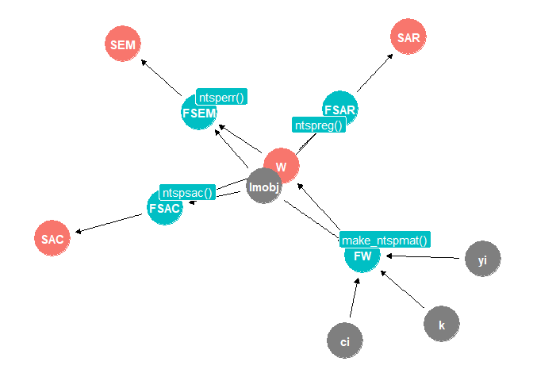

<!-- README.md is generated from README.Rmd. Please edit that file -->

# The `tscsdep` package

<!-- badges: start -->

[](https://CRAN.R-project.org/package=tscsdep)
[](https://www.repostatus.org/#active)
<!-- badges: end -->

## Description

A package to help estimate some of the (linear) spatial and
spatio-temporal autogressive models discussed in Cook, Hays and Franzese
(2020, 2021). The package provides tools to create geographic (k-nearest
neighbor) spatial weights matrices for estimating Spatial AutoRegressive
(SAR) models, Spatial Error Models (SEM), and Spatial Autocorrelation
(SAC) models. The package is designed to work with **unbalanced**
Country-Year Time-Series-Cross-Section (TSCS) datasets.

## Installation

The package can be installed using `devtools`

    # The development version from GitHub:

    library(devtools); devtools::install_github("judechays/STADL", dependencies = TRUE)

## Functions

TSCS spatial weights matrices can be created for any cross-section of
countries in the international system up until the year 2019, using the
`cshapes` package. The cross-sections can change across years to account
for country entry into and exit from the international system.

<table>
<colgroup>
<col style="width: 24%" />
<col style="width: 20%" />
<col style="width: 25%" />
<col style="width: 30%" />
</colgroup>
<thead>
<tr class="header">
<th style="text-align: center;">Object</th>
<th style="text-align: center;">Method</th>
<th style="text-align: center;">Variables</th>
<th style="text-align: center;">Function</th>
</tr>
</thead>
<tbody>
<tr class="odd">
<td style="text-align: center;">Weights Matrix</td>
<td style="text-align: center;"><div class="line-block">k-nearest neighbor</div></td>
<td style="text-align: center;"><div class="line-block"><code>ols</code> <code>country_name</code> <code>year</code> <code>k</code></div></td>
<td style="text-align: center;"><div class="line-block"><code>make_ntspmat(lmobj, ci, yi, k=4)</code></div></td>
</tr>
<tr class="even">
<td style="text-align: center;">Spatial AutoRegressive (SAR)</td>
<td style="text-align: center;"><code>spatialreg::lagsarlm</code></td>
<td style="text-align: center;"><code>ols</code> <code>W</code></td>
<td style="text-align: center;"><code>ntspreg(ols, W)</code></td>
</tr>
<tr class="odd">
<td style="text-align: center;">Spatial error model (SEM)</td>
<td style="text-align: center;"><code>spatialreg::errorsarlm</code></td>
<td style="text-align: center;"><code>ols</code> <code>W</code></td>
<td style="text-align: center;"><code>ntsperr(ols, W)</code></td>
</tr>
<tr class="even">
<td style="text-align: center;">Spatial Autocorrelation (SAC)</td>
<td style="text-align: center;"><code>spatialreg::sacsarlm</code></td>
<td style="text-align: center;"><code>ols</code> <code>W</code></td>
<td style="text-align: center;"><code>ntspsac(ols, W)</code></td>
</tr>
</tbody>
</table>

### **TSCS Spatial Weights Matrix**

The syntax for creating a k-nearest neighbor spatial weights matrix is

``` r
W <- make_ntspmat(lmobj = ols, ci = country_name, yi = year, k=4)
```

where **ols** refers to the object returned from a linear regression,
using the `lm` function (`lm(formula = y ~ x, data = data)`).
**country_name** is the variable that identifies the sample countries,
and **year** is the variable that identifies the sample years. The
parameter **k** is the number of nearest neighbors you want to include
the spatial weights matrix, **W**.

The package also provides convenient wrapper functions to estimate the
**SAR**, **SEM** and **SAC** models using the spatial weights matrix,
**W**. The wrappers call the `largsarlm`, `errorsarlm`, and `sacsarlm`
functions from the `spatialreg` package. The main advantage of the
wrapper functions is that they process the weights matrix created by
`make_ntspmat` for use with the `spatialreg` functions.

### **Spatial AutoRegressive (SAR)**

The syntax for estimating the SAR model is

``` r
ntspreg(ols, W) 
```

where **ols** again refers to the object returned from a linear
regression using the `lm` function (`lm(formula = y ~ x, data = data)`),
and **W** is the spatial weights matrix created using the `make_ntspmat`
function.

### **Spatial Error Model (SEM)**

``` r
ntsperr(ols, W) 
```

### **Spatial Autocorrelation (SAC)**

``` r
ntspsac(ols, W) 
```

### Inputs, Functions and Outputs

-   <p style="color: #00bfff">
    Functions (blue)
    </p>
    <p>
    The package includes four functions: <b>make_ntspmat()</b>,
    <b>ntspreg()</b>, <b>netsperr()</b>, and <b>ntspsac()</b>. These
    functions take inputs (arguments) and return outputs (lists).
    </p>

-   <p style="color:#808080">
    Inputs (grey)
    </p>
    <p>
    The functions take four inputs: country names <b>ci</b>, years
    <b>yi</b>, number of neighbors <b>k</b>, and the returned list from
    calling the linear model (lm) function <b>lmobj</b>.
    </p>

-   <p style="color: #ff6600">
    Outputs (orange)
    </p>
    <p>
    Each function returns an output. The function <b>make_ntspmat()</b>
    returns a k-nearest neighbor spatial weights matrix. The functions
    <b>ntspreg()</b>, <b>netsperr()</b>, and <b>ntspsac()</b> return
    lists of results from the estimation of their respective spatial
    regression models.
    </p>

<!-- -->

### Tools for merging your data with `cshapes`

One of the challenges when using `make_ntspmat()` to create a spatial
weights matrix is matching the country names from your data to the ones
used in `cshapes`. The package includes some helper functions that make
this recoding process easier. These functions are discussed and
illustrated below.

<table>
<colgroup>
<col style="width: 19%" />
<col style="width: 58%" />
<col style="width: 8%" />
<col style="width: 13%" />
</colgroup>
<thead>
<tr class="header">
<th>Object</th>
<th>Description</th>
<th>Input</th>
<th>Function</th>
</tr>
</thead>
<tbody>
<tr class="odd">
<td>Country name list</td>
<td>List of all country names in <code>cshapes</code></td>
<td></td>
<td><code>names_list()</code></td>
</tr>
<tr class="even">
<td>Country information: <code>cowcode</code></td>
<td>Provides country information in <code>cshapes</code>, if you know <code>cowcode</code>. It gives: country name, start date, and end date.</td>
<td><div class="line-block"><code>cowcode</code></div></td>
<td><div class="line-block"><code>name_code(cowcode)</code></div></td>
</tr>
<tr class="odd">
<td>Country information: <code>country_name</code></td>
<td>Provides country information in <code>cshapes</code>, if you know <code>country_name</code>. It gives: cowcode, start date, and end date.</td>
<td><div class="line-block"><code>country_name</code></div></td>
<td><div class="line-block"><code>name_text("Country name")</code></div></td>
</tr>
</tbody>
</table>

If you run `make_ntspmat` and receive a message saying that *Some of
your Country-Years are not Matched* you can use the helper functions
above to fix the problem.

##### List of all country names in `cshapes`

``` r
names_list()
```

This returns a list with all country names which looks like this:

    #>   [1] "United States of America"             
    #>   [2] "Canada"                               
    #>   [3] "Bahamas"                              
    #>   [4] "Cuba"                                 
    #>   [5] "Haiti"                                
    #>   [6] "Dominican Republic"                   
    #>   [7] "Jamaica"                 

##### Checking country names and starting/ending dates in `cshapes` if you have a country’s COW code.

For example, if you have the United States in your data, and you know
`cowcode==2`, then you can check exact country name used in `cshapes`.

``` r
name_code(2)
#> [[1]]
#> [1] "United States of America"
#> 
#> [[2]]
#> [1] "Start date"
#> 
#> [[3]]
#> [1] "1886-01-01" "1959-01-03" "1959-08-21"
#> 
#> [[4]]
#> [1] "End date"
#> 
#> [[5]]
#> [1] "1959-01-02" "1959-08-20" "2019-12-31"
```

From this output, we can see that the country name used by `cshapes` is
“United States of America.” We also see that there are three separate
entries and thus three start and end dates. The start date for `cshapes`
is 1886-01-01. The two additional entries for the United States
correspond to the extensions of statehood to Alaska and Hawaii
respectively.

##### Checking country COW codes and starting/ending dates in `cshapes` if you have a country’s name.

If you have a country’s name, but you are uncertain whether the period
you are analyzing is covered by `cshapes`, you can check using the
`name_text` function.

``` r
name_text("Uruguay")
#> [[1]]
#> [1] "Correlates of War Code"
#> 
#> [[2]]
#> [1] 165
#> 
#> [[3]]
#> [1] "Start date"
#> 
#> [[4]]
#> [1] "1886-01-01"
#> 
#> [[5]]
#> [1] "End date"
#> 
#> [[6]]
#> [1] "2019-12-31"
```

<!-- 
## Example 1 

The data used in the following example come from Miguel, Edward, and Shanker Satyanath. 2011. "Re-examining Economic Shocks and Civil Conflict." American Economic Journal: Applied Economics, 3 (4): 228-32. DOI: 10.1257/app.3.4.228 The Miguel and Satyanath dataset contains data on rainfall, economic growth, and civil conflict for the period 1981–1999.


### Re-examining Economic Shocks and Civil Conflict (Edward Miguel and Shanker Satyanath, 2011)

#### Load data

To begin we read the data and run the non-spatial linear regression that we will use to create the spatial weights matrix.


```r
library(tscsdep)
```


```r
library(haven)
data <- read_dta("./inst/extdata/AEJApp_2011-0102_Stata-data-file.dta")

```

#### OLS Estimation


```r
# Panel C: reduced form
reg <- lm(any_prio_mss ~ gpcp_g + gpcp_g_l +as.factor(year)+as.factor(country_name), data=data)
```

#### Create the Weight Matrix: make_ntspmat

Once we have estimated our OLS model we can run the `make_ntspmat` function, which will create a nearest neighbor spatial weights matrix, if all country names and time periods in the dataset match with those used and covered in `cshapes`.

We start by assuming the country names in the Miguel and Satyanath (2011) dataset match the country names in the `cshapes` package. Unfortunately, they do not match perfectly, and we receive an error message: *"Error in make_ntspmat(reg, country_name, year, 2): Some of your Country-Years are not Matched"*

Specifically, in this data, there are 7 countries with names that do not match. We can solve this problem by re-naming these countries. For example "Ivory Coast" should be "Cote D'Ivoire". The country names used in `cshapes` are provided by the helper function `names_list()`.  You can also check the start (entry) and end (exit) dates using `name_text("Country Name")` and `name_code(cowcode)` helper functions.


```r
W <- make_ntspmat(reg,country_name,year,2)
```

``` {}
==============================================================================
       Data Country Name       Data Start Year COW Country Name COW Start Year
------------------------------------------------------------------------------
1         Burkina Faso              1981                                      
2         Ivory Coast               1981                                      
3          Madagascar               1981                                      
4          Swaziland                1981                                      
5 Tanzania, United Republic of      1981                                      
6            Zaire                  1981                                      
7           Zimbabwe                1981                                      
------------------------------------------------------------------------------
```

The following code, using the `DataCombine` package, re-names the unmatched countries.


```r
library (DataCombine)

data$country_name<-recode_factor(data$country_name,"Burkina Faso"="Burkina Faso (Upper Volta)")
data$country_name<-recode_factor(data$country_name,"Ivory Coast"="Cote D'Ivoire")
data$country_name<-recode_factor(data$country_name,"Madagascar"="Madagascar (Malagasy)")
data$country_name<-recode_factor(data$country_name,"Swaziland"="Swaziland (Eswatini)")
data$country_name<-recode_factor(data$country_name,"Tanzania, United Republic of"="Tanzania (Tanganyika)")
data$country_name<-recode_factor(data$country_name,"Zaire"="Congo, Democratic Republic of (Zaire)")
data$country_name<-recode_factor(data$country_name,"Zimbabwe"="Zimbabwe (Rhodesia)")

```

Once we have corrected the country names, we can re-estimate the non-spatial linear regression model and the `make_ntspmat`. The function generates the weights matrix year by year. While running, each year's cross-section with sample countries identified by COW codes will be displayed. If the function stops before the end of the sample you will be able to recognize the problematic cross-section (year). If all of the countries in a given cross-section match with `cshapes`, you will see a message saying *"All of your Countries are Matched."*


```r
reg<- lm(any_prio_mss ~ gpcp_g + gpcp_g_l +as.factor(year)+as.factor(country_name), data=data)

W <- make_ntspmat(reg,country_name,year,2)

```

```{}
#> [1] 1981
#>  [1] 404 420 432 433 434 435 436 437 438 439 450 451 452 461 471 475 481 482 483
#> [20] 484 490 500 501 510 516 517 520 522 530 540 541 551 552 553 560 570 571 572
#> [39] 580 625
#> [1] 1982
#>  [1] 404 420 432 433 434 435 436 437 438 439 450 451 452 461 471 475 481 482 483
#> [20] 484 490 500 501 510 516 517 520 522 530 540 541 551 552 553 560 570 571 572
#> [39] 580 625
#> [1] All of your Countries are Matched.
#> .
#> .
#> .
#> [1] 1998
#>  [1] 404 420 432 433 434 435 436 437 438 439 451 452 461 471 475 481 482 483 484
#> [20] 490 500 501 510 516 517 530 540 541 551 552 553 560 565 570 571 572 580 625
#> [1] All of your Countries are Matched.
#> [1] 1999
#>  [1] 404 420 432 433 434 435 436 437 438 439 451 452 461 471 475 481 482 483 484
#> [20] 500 501 510 516 517 530 540 541 551 552 553 560 565 570 571 572 580
#> [1] All of your Countries are Matched.
```

#### Estimate Spatial Lag Models

**W** is the two-country nearest-neighbor weights matrix.


##### SAR `ntspreg`

Now, we are ready to run the function `ntspreg`, which returns a list of output from the `lagsarlm` function. This accounts for spatial dependence in the outcome, civil conflict, and distributed lag temporal dependence in the relationship between civil conflict and economic shocks.

With the SAR model we can see that we reject the null for $\rho$ with 99% of confidence $\rightarrow$ **spatial interdependence**.


```r
sar_reex <- ntspreg(reg,W) 
summary(sar_reex)
```

##### SEM `ntsperr`

We can also compare the estimated SAR model with an Error model using the function $\texttt{ntsperr}$, which returns a list of output from the function $\texttt{errorsarlm}$ from the `spatialreg` package.

With the error model we can see that we reject the null for $\lambda$ with 99% of confidence $\rightarrow$ **clustering in the unobservables** 


```r
sdem_reex <- ntsperr(reg,wm)
summary(sdem_reex)
```

##### SAC `ntspsac`

We can also compare the previous models with a SAC specification using the function $\texttt{ntspsac}$, which returns a list of output from the function $\texttt{sacsarlm}$ from the `spatialreg` package.

With the SAC model we can see that we reject the null for $\lambda$ with 95% of confidence, and the null for  $\rho$ with 99% of confidence $\rightarrow$  **clustering in the disturbances by allowing them to follow a spatial AR process**.


```r
sac_reex <- ntspsac(reg,wm)
summary(sac_reex)
```

##### Interpretation and diagnostic

You can run different models, compare the BIC of each one of them, and whether there are indications of interdependence and clustering in the unobservables.


```r
BIC(sar_reex)
BIC(sdem_reex)
BIC(sac_reex)

```

In this example the *SAR* model is the one with the lowest BIC.

You can also extract the log-likelihood of each model. 


```r
logLik(sar_reex)
logLik(sdem_reex)
logLik(sac_reex)
```
#### What is next?

You can repeat the process using a different number of $k$ neighbors. 


```r
reg<- lm(any_prio_mss ~ gpcp_g + gpcp_g_l +as.factor(year)+as.factor(ccode), data=data)

wm <- make_ntspmat(reg,country_name,year,10)

```
-->

## Example: Income and Democracy (Acemoglu et al., 2008)

The data used in this example come from Acemoglu, D., Johnson, S.,
Robinson, J. A. & Yared, P. (2008), “Income and democracy,” American
Economic Review 98(3), 808–42. The dataset includes a global sample of
countries’ GDPs and their democracy scores (Polity IV scores) for the
period 1960–2000 (5-year averages). A more extensive re-analysis is
presented in Cook, Hays, and Franzese (2021).

The dependent variable, democracy **(polity4)**, is the Polity IV
Democracy Index. The main independent variable is GDP per capita (in
PPP) **lrgdpchL**.

We start by matching country names and creating the spatial weights
matrix. Then we estimate spatio-temporal versions of the SAR, SEM, and
SAC models. These models account for global waves of democratization
with period fixed effects and over-time persistence in democracy scores
by including the temporally lagged dependent variable, **polity4L**, as
a regressor.

#### Load data

``` r
data<-read.csv("./inst/extdata/aer_5year_APSR_full.csv")
```

#### OLS estimation

``` r
reg<-lm(formula = polity4 ~ polity4L + lrgdpchL + as.factor(year), data = data)
```

#### Create the Weight Matrix: `make_ntspmat`

``` r
W <- make_ntspmat(reg,country,year,10)
```

In this dataset, there are 29 countries with names that do not match the
country names used in `cshapes`. We can solve this problem by re-naming
these countries. For example “Cote d’Ivoire” should be “Cote D’Ivoire”.
The country names used in `cshapes` are provided by the helper function
`names_list()`. We can also check the start (entry) and end (exit) dates
using `name_text("Country Name")` and `name_code(cowcode)` helper
functions.

    =======================================
        Data Country Name   Data Start Year
    ---------------------------------------
    1        Belarus             2000      
    2      Burkina Faso          1965      
    3        Cambodia            2000      
    4    Congo, Dem. Rep.        1970      
    5      Congo, Rep.           1965      
    6     Cote d'Ivoire          1965      
    7    Egypt, Arab Rep.        1960      
    8   Ethiopia -pre 1993       1960      
    9     Ethiopia 1993-         2000      
    10     Gambia, The           1970      
    11       Germany             1995      
    12         Iran              1960      
    13        Italy              1960      
    14     Korea, Rep.           1960      
    15    Macedonia, FYR         2000      
    16      Madagascar           1965      
    17  Pakistan-post-1972       1980      
    18  Pakistan-pre-1972        1960      
    19       Romania             1965      
    20        Russia             2000      
    21      Sri Lanka            1960      
    22 Syrian Arab Republic      1970      
    23       Tanzania            1970      
    24        Turkey             1970      
    25    United States          1960      
    26    Venezuela, RB          1960      
    27       Vietnam             1995      
    28        Yemen              2000      
    29       Zimbabwe            1975      
    ---------------------------------------

**Fixing country names**

The following code, using the `recode_factor` function from the
`DataCombine` package, re-names the unmatched countries.

``` r
library (DataCombine)

data$country<-recode_factor(data$country,"Belarus"="Belarus (Byelorussia)")
data$country<-recode_factor(data$country,"Burkina Faso"="Burkina Faso (Upper Volta)")
data$country<-recode_factor(data$country,"Cambodia"="Cambodia (Kampuchea)")
data$country<-recode_factor(data$country,"Congo, Dem. Rep."="Congo, Democratic Republic of (Zaire)")
data$country<-recode_factor(data$country,"Congo, Rep."="Congo")
data$country<-recode_factor(data$country,"Cote d'Ivoire"="Cote D'Ivoire")
data$country<-recode_factor(data$country,"Egypt, Arab Rep."="Egypt")
data$country<-recode_factor(data$country,"Ethiopia -pre 1993"="Ethiopia")
data$country<-recode_factor(data$country,"Ethiopia 1993-"="Ethiopia")
data$country<-recode_factor(data$country,"Gambia, The"="Gambia")
data$country<-recode_factor(data$country,"Germany"="German Federal Republic")
data$country<-recode_factor(data$country,"Iran"="Iran (Persia)")
data$country<-recode_factor(data$country,"Italy"="Italy/Sardinia")
data$country<-recode_factor(data$country,"Korea, Rep."="Korea, Republic of")
data$country<-recode_factor(data$country,"Macedonia, FYR"="Macedonia (FYROM/North Macedonia)")
data$country<-recode_factor(data$country,"Madagascar"="Madagascar (Malagasy)")
data$country<-recode_factor(data$country,"Pakistan-post-1972"="Pakistan")
data$country<-recode_factor(data$country,"Pakistan-pre-1972"="Pakistan")
data$country<-recode_factor(data$country,"Romania"="Rumania")
data$country<-recode_factor(data$country,"Russia"="Russia (Soviet Union)")
data$country<-recode_factor(data$country,"Sri Lanka"="Sri Lanka (Ceylon)")
data$country<-recode_factor(data$country,"Syrian Arab Republic"="Syria")
data$country<-recode_factor(data$country,"Tanzania"="Tanzania (Tanganyika)")
data$country<-recode_factor(data$country,"Turkey"="Turkey (Ottoman Empire)")
data$country<-recode_factor(data$country,"United States"="United States of America")
data$country<-recode_factor(data$country,"Venezuela, RB"="Venezuela")
data$country<-recode_factor(data$country,"Vietnam"="Vietnam, Democratic Republic of")
data$country<-recode_factor(data$country,"Yemen"="Yemen (Arab Republic of Yemen)")
data$country<-recode_factor(data$country,"Zimbabwe"="Zimbabwe (Rhodesia)")
```

``` r
reg<-lm(formula = polity4 ~ polity4L + lrgdpchL + as.factor(year), data = data)
summary(reg)
```

Once we have corrected the country names, we can re-estimate the
non-spatial linear regression model and create the spatial weights
matrix using `make_ntspmat`.

    reg<-lm(formula = polity4 ~ polity4L + lrgdpchL + as.factor(year), data = data)
    summary(reg)
    #> 
    #> Call:
    #> lm(formula = polity4 ~ polity4L + lrgdpchL + as.factor(year), 
    #>     data = data)
    #> 
    #> Residuals:
    #>      Min       1Q   Median       3Q      Max 
    #> -0.73614 -0.08293 -0.01148  0.06733  0.69875 
    #> 
    #> Coefficients:
    #>                      Estimate Std. Error t value Pr(>|t|)    
    #> (Intercept)         -0.257342   0.062472  -4.119 4.17e-05 ***
    #> polity4L             0.748899   0.021605  34.663  < 2e-16 ***
    #> lrgdpchL             0.053035   0.008012   6.619 6.42e-11 ***
    #> as.factor(year)1965 -0.055404   0.033306  -1.663   0.0966 .  
    #> as.factor(year)1970 -0.071326   0.032185  -2.216   0.0269 *  
    #> as.factor(year)1975 -0.074252   0.031657  -2.345   0.0192 *  
    #> as.factor(year)1980 -0.043703   0.031617  -1.382   0.1673    
    #> as.factor(year)1985 -0.029291   0.031616  -0.926   0.3545    
    #> as.factor(year)1990  0.041154   0.031359   1.312   0.1898    
    #> as.factor(year)1995  0.073656   0.031238   2.358   0.0186 *  
    #> as.factor(year)2000  0.013973   0.030396   0.460   0.6458    
    #> ---
    #> Signif. codes:  0 '***' 0.001 '**' 0.01 '*' 0.05 '.' 0.1 ' ' 1
    #> 
    #> Residual standard error: 0.1828 on 843 degrees of freedom
    #> Multiple R-squared:  0.7725, Adjusted R-squared:  0.7698 
    #> F-statistic: 286.2 on 10 and 843 DF,  p-value: < 2.2e-16

``` r
W <- make_ntspmat(reg,country,year,10)
```

The `make_ntspmat` function generates the weights matrix year by year.
While running, each year’s cross-section, with sample countries
identified by COW codes, will be displayed. If the function stops before
the end of the sample you will be able to recognize the problematic
cross-section (year). If all of the countries in a given cross-section
match with `cshapes`, you will see a message saying *“All of your
Countries are Matched.”*

    #> [1] 1960
    #>  [1] 900 305 211 140 20  225 155 710 100 94  390 42  130 651 230 530 375 220 200
    #> [20] 350 90  91  750 205 630 395 666 325 663 740 732 780 70  93  210 385 920 770
    #> [39] 95  135 840 235 150 92  380 800 713 165 2   101 560
    #> [1] 1965
    #>  [1] 160 900 305 211 434 439 145 140 482 20  225 155 710 437 471 484 100 94  390
    #> [20] 130 651 230 530 375 220 481 200 452 438 350 90  91  850 750 205 630 395 666
    #> [39] 325 663 740 732 780 600 580 70  432 435 820 436 475 93  210 385 790 920 770
    #> [58] 95  135 840 235 150 360 433 92  380 483 461 800 713 165 2   101 560
    #> [1] All of your Countries are Matched.
    #> [1] 1970
    #>  [1] 160 900 305 211 434 439 145 140 482 20  225 155 710 437 471 484 100 94  390
    #> [20] 615 130 651 230 530 375 220 481 200 452 438 420 350 90  91  850 750 205 630
    #> [39] 395 666 325 51  663 740 501 732 780 600 580 70  432 435 553 820 436 475 93 
    #> [58] 210 385 790 920 95  135 840 235 150 360 517 433 830 451 92  380 652 483 461
    #> [77] 800 52  616 640 713 510 500 165 2   101 560 490 551
    #> [1] All of your Countries are Matched.
    #> [1] 1975
    #>  [1] 160 900 305 516 211 434 439 145 140 571 482 20  225 155 710 437 471 484 100
    #> [20] 94  352 390 42  615 130 651 530 375 950 220 481 200 452 438 420 411 350 90 
    #> [39] 110 91  41  310 850 750 205 630 395 666 325 51  663 740 501 732 780 570 600
    #> [58] 580 70  432 435 590 553 820 436 475 93  210 385 790 920 95  135 840 150 360
    #> [77] 517 433 830 451 92  380 652 483 461 800 52  616 640 713 510 500 165 2   101
    #> [96] 560 490 551 552
    #> [1] All of your Countries are Matched.
    #> [1] 1980
    #>   [1] 540 160 900 305 516 211 434 439 771 145 140 571 482 20  225 155 710 437
    #>  [19] 471 484 100 581 94  352 390 42  615 130 651 530 375 950 220 481 200 452
    #>  [37] 438 420 404 411 350 90  110 41  310 850 750 205 395 666 325 51  663 740
    #>  [55] 501 732 780 570 600 580 70  432 541 435 590 553 820 436 475 210 385 790
    #>  [73] 920 770 95  135 840 910 150 360 517 433 830 451 380 652 461 800 52  616
    #>  [91] 640 713 510 500 165 2   101 560 490 551 552
    #> [1] All of your Countries are Matched.
    #> [1] 1985
    #>   [1] 540 160 900 305 516 211 434 439 771 145 140 571 482 20  225 155 710 437
    #>  [19] 471 484 100 581 94  352 390 42  615 130 651 230 530 375 950 220 481 200
    #>  [37] 452 438 420 404 411 350 110 41  310 850 750 205 395 666 325 51  663 740
    #>  [55] 501 732 780 570 600 580 70  432 541 435 590 553 820 436 475 210 385 790
    #>  [73] 920 770 95  135 840 910 290 235 150 360 517 433 830 451 380 652 461 800
    #>  [91] 52  616 640 713 510 165 2   101 560 490 551 552
    #> [1] All of your Countries are Matched.
    #> [1] 1990
    #>   [1] 540 160 900 305 516 211 439 771 145 140 571 482 20  225 155 710 437 471
    #>  [19] 484 100 581 94  40  352 390 42  615 130 651 230 530 375 950 220 200 452
    #>  [37] 438 420 404 411 350 110 91  41  310 850 750 205 630 395 666 325 51  663
    #>  [55] 740 501 732 780 570 600 580 70  432 541 435 590 553 820 436 475 93  210
    #>  [73] 385 790 920 770 95  135 840 910 290 235 150 360 517 433 830 451 92  380
    #>  [91] 652 483 461 800 52  616 640 713 510 165 2   101 560 490 551 552
    #> [1] All of your Countries are Matched.
    #> [1] 1995
    #>   [1] 160 900 305 211 439 771 145 140 571 482 20  225 155 710 437 471 484 100
    #>  [19] 94  40  352 255 390 42  615 130 651 230 375 950 220 200 452 438 420 404
    #>  [37] 411 350 90  110 91  41  310 850 750 205 630 395 666 325 51  663 740 501
    #>  [55] 732 780 570 600 580 70  432 541 435 590 553 820 565 436 475 93  210 385
    #>  [73] 790 920 770 95  135 840 910 290 235 150 360 517 433 830 451 92  380 652
    #>  [91] 483 461 800 52  616 640 713 510 500 165 2   101 816 560 551 552
    #> [1] All of your Countries are Matched.
    #> [1] 2000
    #>   [1] 339 160 371 900 305 373 211 434 439 771 355 370 145 140 571 482 20  225
    #>  [19] 155 710 437 471 484 100 94  40  352 316 255 390 42  615 130 651 230 366
    #>  [37] 530 375 220 481 200 452 438 420 404 411 350 90  110 91  344 41  310 850
    #>  [55] 750 205 630 395 666 325 51  663 740 705 501 703 811 732 780 368 367 600
    #>  [73] 359 580 70  343 432 541 435 590 553 820 565 436 475 93  210 385 790 920
    #>  [91] 770 95  840 910 290 235 150 360 365 517 433 830 92  317 349 380 652 483
    #> [109] 461 800 52  616 640 713 510 500 369 165 2   704 101 816 679 560 551 552
    #> [1] All of your Countries are Matched.

#### Estimate Spatial Lag Models

##### SAR `ntspreg`

In this model, ρ is the coefficient for the spatially lagged outcome
variable.

``` r
lag <- ntspreg(reg,W)
summary(lag)
```

    #> 
    #> Call:spatialreg::lagsarlm(formula = formula, data = df, listw = listw, 
    #>     method = "eigen", zero.policy = TRUE, tol.solve = 1e-10)
    #> 
    #> Residuals:
    #>        Min         1Q     Median         3Q        Max 
    #> -0.7549372 -0.0809244 -0.0095003  0.0670258  0.6844804 
    #> 
    #> Type: lag 
    #> Coefficients: (asymptotic standard errors) 
    #>                       Estimate Std. Error z value  Pr(>|z|)
    #> (Intercept)         -0.3079667  0.0656794 -4.6889 2.746e-06
    #> polity4L             0.7457442  0.0214521 34.7633 < 2.2e-16
    #> lrgdpchL             0.0531095  0.0079384  6.6902 2.229e-11
    #> as.factor(year)1965 -0.0589817  0.0330236 -1.7860   0.07409
    #> as.factor(year)1970 -0.0751453  0.0319103 -2.3549   0.01853
    #> as.factor(year)1975 -0.0758992  0.0313635 -2.4200   0.01552
    #> as.factor(year)1980 -0.0436485  0.0313208 -1.3936   0.16344
    #> as.factor(year)1985 -0.0306376  0.0313216 -0.9782   0.32799
    #> as.factor(year)1990  0.0407703  0.0310648  1.3124   0.18938
    #> as.factor(year)1995  0.0733024  0.0309442  2.3689   0.01784
    #> as.factor(year)2000  0.0157911  0.0301255  0.5242   0.60016
    #> 
    #> Rho: 0.092467, LR test value: 4.488, p-value: 0.034134
    #> Asymptotic standard error: 0.042432
    #>     z-value: 2.1792, p-value: 0.02932
    #> Wald statistic: 4.7487, p-value: 0.02932
    #> 
    #> Log likelihood: 247.2436 for lag model
    #> ML residual variance (sigma squared): 0.032792, (sigma: 0.18109)
    #> Number of observations: 854 
    #> Number of parameters estimated: 13 
    #> AIC: -468.49, (AIC for lm: -466)
    #> LM test for residual autocorrelation
    #> test value: 0.33204, p-value: 0.56446

##### SEM `ntsperr`

In this model, λ is the coefficient on the spatially lagged disturbance
term.

``` r
lag_err <- ntsperr(reg,W)
summary(lag_err)
```

    #> 
    #> Call:spatialreg::errorsarlm(formula = formula, data = df, listw = listw, 
    #>     method = "eigen", zero.policy = TRUE, tol.solve = 1e-11)
    #> 
    #> Residuals:
    #>       Min        1Q    Median        3Q       Max 
    #> -0.736974 -0.083456 -0.011526  0.068874  0.698778 
    #> 
    #> Type: error 
    #> Coefficients: (asymptotic standard errors) 
    #>                       Estimate Std. Error z value  Pr(>|z|)
    #> (Intercept)         -0.2589496  0.0621459 -4.1668 3.089e-05
    #> polity4L             0.7475215  0.0214992 34.7698 < 2.2e-16
    #> lrgdpchL             0.0534045  0.0079733  6.6979 2.114e-11
    #> as.factor(year)1965 -0.0560378  0.0330115 -1.6975   0.08960
    #> as.factor(year)1970 -0.0723244  0.0318947 -2.2676   0.02335
    #> as.factor(year)1975 -0.0746763  0.0313722 -2.3803   0.01730
    #> as.factor(year)1980 -0.0432951  0.0313410 -1.3814   0.16715
    #> as.factor(year)1985 -0.0299043  0.0313366 -0.9543   0.33993
    #> as.factor(year)1990  0.0405267  0.0310994  1.3031   0.19253
    #> as.factor(year)1995  0.0728451  0.0309618  2.3527   0.01864
    #> as.factor(year)2000  0.0138366  0.0301252  0.4593   0.64602
    #> 
    #> Lambda: 0.062942, LR test value: 0.65125, p-value: 0.41966
    #> Asymptotic standard error: 0.078322
    #>     z-value: 0.80363, p-value: 0.42161
    #> Wald statistic: 0.64583, p-value: 0.42161
    #> 
    #> Log likelihood: 245.3253 for error model
    #> ML residual variance (sigma squared): 0.032952, (sigma: 0.18153)
    #> Number of observations: 854 
    #> Number of parameters estimated: 13 
    #> AIC: -464.65, (AIC for lm: -466)

##### SAC `ntspsac`

In this model, ρ is the coefficient on the spatially lagged outcome
variable, and λ is the coefficient on the spatially lagged disturbance
term.

``` r
lag_sac <- ntspsac(reg,W)
summary(lag_sac)
```

    lag_sac <- ntspsac(reg,W)
    summary(lag_sac)
    #> 
    #> Call:spatialreg::sacsarlm(formula = formula, data = df, listw = listw, 
    #>     method = "eigen", zero.policy = TRUE, tol.solve = 1e-10)
    #> 
    #> Residuals:
    #>       Min        1Q    Median        3Q       Max 
    #> -0.757587 -0.080138 -0.010874  0.066737  0.680636 
    #> 
    #> Type: sac 
    #> Coefficients: (asymptotic standard errors) 
    #>                      Estimate Std. Error z value  Pr(>|z|)
    #> (Intercept)         -0.313396   0.066420 -4.7184 2.377e-06
    #> polity4L             0.745464   0.021458 34.7400 < 2.2e-16
    #> lrgdpchL             0.052735   0.007919  6.6592 2.753e-11
    #> as.factor(year)1965 -0.059242   0.033072 -1.7913   0.07324
    #> as.factor(year)1970 -0.075151   0.031963 -2.3512   0.01871
    #> as.factor(year)1975 -0.075805   0.031400 -2.4142   0.01577
    #> as.factor(year)1980 -0.044000   0.031348 -1.4036   0.16043
    #> as.factor(year)1985 -0.030298   0.031352 -0.9664   0.33385
    #> as.factor(year)1990  0.041215   0.031080  1.3261   0.18480
    #> as.factor(year)1995  0.073868   0.030974  2.3849   0.01709
    #> as.factor(year)2000  0.016229   0.030163  0.5381   0.59054
    #> 
    #> Rho: 0.10702
    #> Asymptotic standard error: 0.048627
    #>     z-value: 2.2008, p-value: 0.027748
    #> Lambda: -0.054986
    #> Asymptotic standard error: 0.10084
    #>     z-value: -0.54527, p-value: 0.58557
    #> 
    #> LR test value: 4.8089, p-value: 0.090316
    #> 
    #> Log likelihood: 247.4041 for sac model
    #> ML residual variance (sigma squared): 0.032765, (sigma: 0.18101)
    #> Number of observations: 854 
    #> Number of parameters estimated: 14 
    #> AIC: -466.81, (AIC for lm: -466)

##### Model Selection

In this example, all of the specification tools select the **SAR**
model. The Wald and Likelihood ratio tests reject the null hypothesis ρ
= 0, but fail to reject λ = 0. The Akaike Information Criterion (AIC)
also selects the **SAR** as the best fitting model. The Bayesian
Information Criterion selects the **SAR** model as well.

``` r
BIC(lag)
BIC(lag_err)
BIC(lag_sac)
```

    BIC(lag)
    #> [1] -406.7382
    BIC(lag_err)
    #> [1] -402.9015
    BIC(lag_sac)
    #> [1] -400.3092

Given the temporally lagged dependent variable in the **SAR**
specification, this model is the first-order spatio-temporal
autoregressive distributed lag (STADL) model discussed in Cook, Hays and
Franzese (2021).

## Citation

To cite `tscsdep` in publications, please use:

``` r
citation("tscsdep") 
#> 
#> To cite 'tscsdep' in publications, please use:
#> 
#>   Hays, Jude C., Valentina González-Rostani, Scott Cook, and Robert
#>   Franzese. (2021). {tscsdep}: {T}ools for analyzing country-year
#>   time-series-cross-sectional data with spatial and temporal
#>   dependence. version 0.1.0. https://github.com/judechays/STADL
#> 
#> A BibTeX entry for LaTeX users is
#> 
#>   @Manual{,
#>     title = {{tscsdep}: {T}ools for analyzing country-year time-series-cross-sectional data with spatial and temporal dependence},
#>     author = {Jude Hays and Valentina González-Rostani and Scott Cook and Robert Franzese},
#>     note = {version 0.1.0},
#>     year = {2021},
#>     url = {https://github.com/judechays/STADL},
#>   }
```

## Authors

Jude Hays (<jch61@pitt.edu>), Valentina González-Rostani
(<mag384@pitt.edu>), Scott Cook (<sjcook@tamu.edu>), and Robert Franzese
(<franzese@umich.edu>)

### Mantainer

Jude Hays (<jch61@pitt.edu>)

## References

<div id="refs" class="references csl-bib-body hanging-indent">

<div id="ref-acemoglu2008income" class="csl-entry">

Acemoglu, Daron, Simon Johnson, James A Robinson, and Pierre Yared.
2008. “Income and Democracy.” *American Economic Review* 98 (3): 808–42.

</div>

<div id="ref-spatreg3" class="csl-entry">

Bivand, Roger S., Edzer Pebesma, and Virgilio Gomez-Rubio. 2013.
*Applied Spatial Data Analysis with R, Second Edition*. Springer, NY.
<https://asdar-book.org/>.

</div>

<div id="ref-spatreg2" class="csl-entry">

Bivand, Roger, Jan Hauke, and Tomasz Kossowski. 2013. “Computing the
Jacobian in Gaussian Spatial Autoregressive Models: An Illustrated
Comparison of Available Methods.” *Geographical Analysis* 45 (2):
150–79. <https://doi.org/10.1111/gean.12008>.

</div>

<div id="ref-spatreg1" class="csl-entry">

Bivand, Roger, and Gianfranco Piras. 2015. “Comparing Implementations of
Estimation Methods for Spatial Econometrics.” *Journal of Statistical
Software* 63 (18): 1–36. <https://www.jstatsoft.org/v63/i18/>.

</div>

<div id="ref-cook_model_2020" class="csl-entry">

Cook, Scott J., Jude C. Hays, and Robert J. Franzese. 2020. “Model
Specification and Spatial Interdependence.” In *The SAGE Handbook of
Research Methods in Political Science and International Relations*,
edited by Luigi Curini and Robert Franzese, 730–47.

</div>

<div id="ref-cook_stadl_2021" class="csl-entry">

———. Forthcoming. “STADL Up! The Spatio-Temporal Autoregressive
Distributed Lag Model for TSCS Data Analysis.” *American Political
Science Review*.

</div>

<div id="ref-datacomb21" class="csl-entry">

Gandrud, Christopher. 2016. *DataCombine: Tools for Easily Combining and
Cleaning Data Sets*. <https://CRAN.R-project.org/package=DataCombine>.

</div>

<div id="ref-cshapes21" class="csl-entry">

Weidmann, Nils B., Guy Schvitz, and Luc Girardin. 2021. *Cshapes: The
CShapes 2.0 Dataset and Utilities*.
<https://CRAN.R-project.org/package=cshapes>.

</div>

<div id="ref-devtools21" class="csl-entry">

Wickham, Hadley, Jim Hester, and Winston Chang. 2021. *Devtools: Tools
to Make Developing r Packages Easier*.
<https://CRAN.R-project.org/package=devtools>.

</div>

<div id="ref-haven21" class="csl-entry">

Wickham, Hadley, and Evan Miller. 2021. *Haven: Import and Export
’SPSS’, ’Stata’ and ’SAS’ Files*.
<https://CRAN.R-project.org/package=haven>.

</div>

</div>
